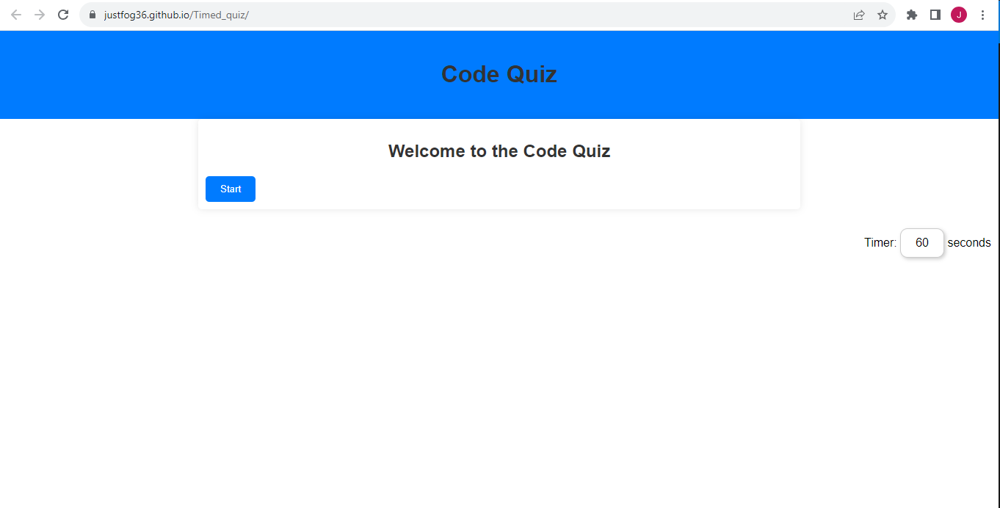

# Timed_quiz
A simple web-based quiz game with a timer.
## Description

This Timed Quiz is a fun and educational web-based quiz game where players can test their knowledge with various questions within a time limit. The game presents a series of multiple-choice questions, and players maintain points for each correct answer. Players lose points for each incorrect answer. They must answer quickly, as time goes by, points are lost.

## Usage 
1. Click the "Start" button to begin the quiz.
2. Answer each question within the time limit.
3. Correct answers earn you points, while incorrect answers reduce your time.
4. When the game ends, you can enter your initials to save your high score.

## Screenshot of deployed page

## Deployed Webpage 

